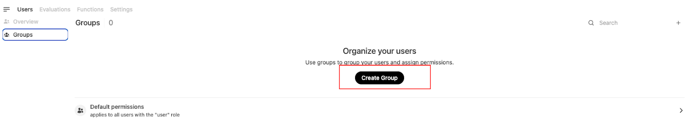

# QuickQuery部署文档

## 修订记录

| 日期       | 版本 | 作者                                         | 描述                                                         |
| ---------- | ---- | -------------------------------------------- | ------------------------------------------------------------ |
| 2025.03.04 | V0.1 | Shuang Yu, Alex Qiu, Lark Zhang, Shawn Zhang | 初始版本，支持快速部署Web服务，本地化部署DeepseekV3和R1, AI联网搜索等功能。 |

## 说明

此文档提供有关如何部署和使用 **QuickQuery** 的详细说明。QuickQuery 提供了本地化部署 web 服务、本地化部署 DeepseekV3 和 R1，以及 AI 联网搜索等功能。目前版本为 v0.1。


## 部署软件环境

QuickQuery 的部署需要支持 Docker 引擎。您可以参考 [Docker 文档](https://docs.docker.com/engine/) 以获取详细的安装和配置指南。

此外，Deepseek V3 和 R1 的本地化部署文档可通过以下链接获取：[Deepseek V3 和 R1 部署手册](https://nvidia-my.sharepoint.com/personal/hanyueh_nvidia_com/_layouts/15/onedrive.aspx?id=%2Fpersonal%2Fhanyueh_nvidia_com%2FDocuments%2Fhhy%2FCustomers%2F幻方%2Fbenchmark%2F)。

## 1. 如何安装

### 1.1 启动QuickQuery的Web服务

只需两个简单步骤，您就可以完成部署。

您应先下载以下脚本：

```shell
wget https://raw.githubusercontent.com/sharonyu-115/open-webui/main/backend/open_webui/routers/openai.py
```

然后，使用以下命令：

```shell
docker run -d -p 3000:8080 --add-host=host.docker.internal:host-gateway -v ./openai.py:/app/backend/open_webui/routers/openai.py -v open-webui:/app/backend/data --name open-webui --restart always ghcr.io/open-webui/open-webui:main
```


您可以使用以下命令查看服务状态：

```shell
docker logs 2ed553db9d89485623edde3db1eea0a6ce377afe813cde0524034a9c07e1ee83
```


> *服务启动后默认支持NV-DEV上模型服务的访问。*

### 1.2 本地部署DeepseekV3和R1

详细的本地化部署指南请参见：[DeepseekV3 和 R1 部署手册](https://nvidia-my.sharepoint.com/personal/hanyueh_nvidia_com/_layouts/15/onedrive.aspx?id=%2Fpersonal%2Fhanyueh_nvidia_com%2FDocuments%2Fhhy%2FCustomers%2F幻方%2Fbenchmark%2F) 。


## 2. 使用说明

### 2.1 作为管理员配置 Open WebUI

#### 2.1.1 创建管理员账户：


#### 2.1.2 配置连接

进入管理面板


点击设置菜单：


进入连接设置：


点击"+"按钮添加连接：


在此，您可以指向远程模型服务API或本地托管的API，只要API兼容OpenAI或Ollama。您可以选择：
1. 企业托管的API端点
2. 本地部署的DeepseekV3或R1的API端点（例如：http://127.0.0.1:8000/v1/completions）

根据需要配置API URL和密钥。在下面例子中，指向企业托管的API端点。


如果连接配置正确，进入模型页面，您应该会看到服务器端托管的所有可用模型。


####  2.1.3 添加其他用户

您可以利用用户组添加其他用户并控制用户的权限。

进入用户界面，添加用户：


创建用户组：



然后点击用户组条目，自定义组权限（如果需要）。


将用户链接到组：


### 2.2 与选定模型聊天

作为用户，登录界面，选择模型，然后与模型聊天！


### 2.3 AI 搜索

在设置页面，我们可以打开网页搜索功能。聊天机器人集成了13个不同的搜索引擎，所有引擎都需要额外的API密钥，除了duckduckgo。


在与LLM聊天时，我们可以打开"Web Search"按钮，以将外部搜索引擎集成进LLM，以生成更好的响应。

### 2.4 语言设置
管理员可以右上角的设置中修改默认的语言设置。


